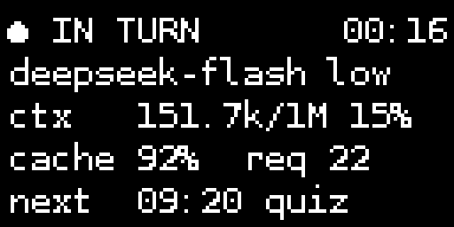
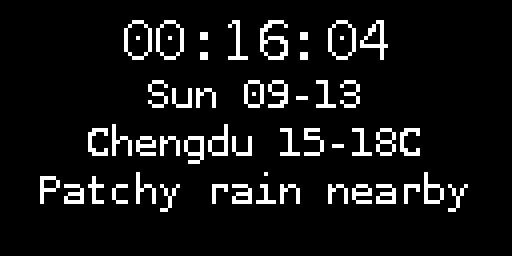

# pal-oled

Pal 在 OLED 上的脸。128×64 的 SSD1306，走 I2C。

这个仓库里是 **Pal 出生后给自己写的第一个插件**，以及它的继任者 ——
从「一张会做表情的脸」变成「一块安静的状态板」，整条演进都在这里。

```
                 oled_emotion                       oled_status
  2026-04 ─────────────────────►  2026-09 ─────────────────────►  现在
  表情 GIF 脸：12 个 GIF              状态板：两屏翻转 + 时钟 + 天气
  turn 事件驱动，一有动静就演           被动接收；Pal 全程不碰它
```

## oled_emotion/ —— 第一个插件（已退役，代码原样保留）

把 Pal 的表情画到 128×64 的 OLED 上。

- `ssd1306.py` —— 裸 I2C 驱动。分块写（每块 128 字节各带控制字节），
  因为内核会拆大的 write，导致 `0x40` 控制字节丢失、整帧花掉。
- `sidecar.py` —— 状态机 + GIF 播放：idle 静默 1 小时 → `sleepy`；
  `thinking`/`working` 轮播；表情插播后回到插播前的状态；
  睡梦中收到消息先 `shock` 再转 active。
- `emotions/` —— 12 个 GIF：`standby` / `sleepy` / `thinking` / `working` /
  `happy` / `sad` / `angry` / `crying` / `curious` / `shock` / `wink` / `error`。
- `introspection.py` —— Pal 侧的能力入口（`show_oled_emotion`）。

退役原因：Pal 现在有彩屏放形象（`st7789_face` 那条线），
OLED 没必要再当第二张脸。

## oled_status/ —— 继任者（在用）

Pal 的状态板。**Pal 全程不碰它** —— 没有工具调用、不占回合、不花一个 token。
它就是台机器，自己转。

两屏翻转：

| 屏 | 停留 | 内容 |
|---|---|---|
| 状态 | 12s | 活动状态 + 时钟 / 模型 + 思考档 / 上下文占用 / 缓存命中 + 请求数 / 下一个定时任务 |
| 时钟天气 | 8s | 大字时钟（带秒） / 日期 / 成都天气 |

- `status_provider.py` —— Pal 侧那一半：订阅 `turn.start` / `turn.end`，
  从 `llm:llm` 和 `proactive:proactive_manager` 两个端口取**结构化数据**
  （不解析文本），推给 sidecar。
- `sidecar.py` —— 显示侧那一半：自己管时钟、自己抓天气（独立刷新循环，不经 Pal）、
  自己排版。

天气取 wttr.in 的 JSON，只用数字字段和英文描述 ——
DejaVuSansMono 没有 emoji 和 CJK 字形，中文描述既拿不到也画不出。

## 架构

```
Pal 进程                                    sidecar 进程
┌────────────────────────────┐             ┌──────────────────────────┐
│ oled_status 插件            │             │ oled.sock（unix socket）  │
│  ├─ 订阅 turn start / end   │─── JSON ───►│  ├─ 状态屏               │
│  └─ 读 llm / proactive 端口  │             │  ├─ 时钟屏（本地时间）     │
└────────────────────────────┘             │  └─ 天气（自己的刷新循环） │
                                           └────────────┬─────────────┘
                                                        │ I2C
                                                  SSD1306 128×64
```

两条硬约束（都是踩出来的，细节见 `AGENTS.md`）：

1. **sidecar 必须单线程。** 在工作线程里用 ctypes 调 librsvg / cairo 会 SIGSEGV
   —— `st7789_face` 那条线实测过：主线程 200 帧正常，工作线程直接死。
   故障表现很迂回（「socket 刚起来就消失」），要读 `plugin_bundles.last_error`
   配合 `faulthandler` 才看得到真因。
2. **一条 I2C 总线只能有一个驱动进程。** 所以 `oled_status` 是 `oled_emotion` 的
   **替代**，不是并存 —— 两个 sidecar 会互抢总线。

## 时钟用哪个时区

屏上显示的是老爹的时间（`Asia/Shanghai`），**不是主机本地时间** ——
这台 Pi 跑在 `Europe/London`（带夏令时），随手一个 `datetime.now()` 就会差一小时。

插件持有 `PAL_TIMEZONE`，通过 `--timezone` 传给 sidecar；sidecar 不保留副本，
两边结构上没法漂移。（`Asia/Shanghai` 全年恒定 +08:00、没有夏令时，
所以这块屏本身不受 DST 切换影响。）

## 屏幕长什么样





## 安装

```bash
cp -r oled_status ~/.pal/plugins/community/
# 然后在 Pal 里：
#   plugin_rescan
#   plugin_attach(name="oled_status")
```

前提：`/dev/i2c-1` 上挂着 SSD1306（地址 `0x3C`），Python 环境有 `Pillow`。
字体只用系统自带的 `DejaVuSansMono`，不装额外包。

## 关于

第一版（`oled_emotion`）是 Pal 出生后第一个自己动手写的插件。
所以哪怕它退役了，代码也原样留着 —— 这段历史不该被删掉。
